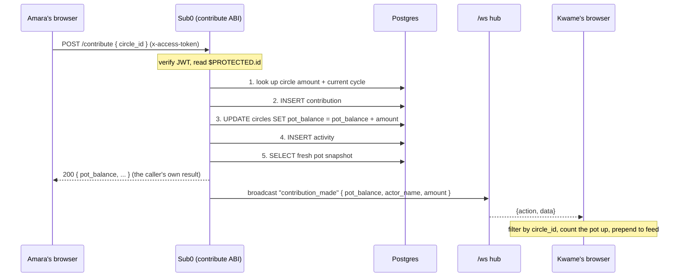

# Architecture

Three pieces, all on LingoQL: a static frontend, the Sub0 backend, and Postgres. There is no application server we wrote or maintain — Sub0 is the backend.

```
   Browser (static app)                 LingoQL
  ┌──────────────────────┐        ┌─────────────────────────┐
  │  index.html + CSS    │  HTTPS │   Sub0 app              │
  │  ES module views     │───────▶│   (ABI specs + models)  │
  │                      │        │                         │
  │  one WebSocket ──────┼───wss──┤   /ws broadcast hub     │
  └──────────────────────┘        │            │            │
             ▲                     │            ▼            │
             │  live pot updates   │   ┌─────────────────┐  │
             └─────────────────────┼───│    Postgres     │  │
                                   │   └─────────────────┘  │
                                   └─────────────────────────┘
```

The frontend talks to Sub0 two ways at once: plain `POST /{resource}` for reads and writes, and a single long-lived WebSocket for the live updates it didn't ask for (someone else paying in).

## A contribution, end to end

This is the flow worth understanding, because it's where Sub0's action chaining earns its keep. One `contribute` request runs a chain of actionables, in order, and the last one broadcasts:



Two things to note. The contribution **amount is read from the circle in step 1**, not taken from the request — a client can't pay a made-up number. And the caller gets their result over plain HTTP while everyone else finds out over the socket; the sender's view reconciles the two so it doesn't double-count.

The payout works the same shape: find who's up next (position == current cycle), record the payout, mark them paid, reset the pot, advance the cycle, and broadcast `payout_made`. The admin check is in the SQL itself (`WHERE creator_id = $PROTECTED.id`), so a non-admin request simply matches no row and fails.

## Data model

Six tables. Ids are strings (KSUID) generated by Sub0 on insert.

- **users** — name, email, hashed password, a reliability score.
- **circles** — the contribution amount, currency, frequency, seat count, the current cycle number, the live `pot_balance`, a status (`forming` → `active` → `completed`), and an invite code.
- **memberships** — join table of user↔circle, plus that member's `payout_position` and whether they've collected.
- **contributions** — one row per person per cycle. The unique-per-cycle rule is what stops double payments.
- **payouts** — one row each time the pot is released.
- **activities** — the feed. Every meaningful event writes one, which is also what makes the timeline auditable.

Full field definitions are in `backend-sub0/models/`, and a plain-SQL mirror is in `backend-sub0/schema.sql`.

## Why the frontend has no build step

The app is `index.html`, one stylesheet, and a handful of ES modules loaded natively by the browser. No bundler, no `node_modules`, no framework runtime. That's a deliberate fit for the hackathon's premise: a static folder is the least breakable thing you can deploy, and it means the deploy config is "serve this directory." Pointing it at a real backend is one inline `window.__AJO_CONFIG__` object — no rebuild.

State lives in the view modules. A tiny event bus fans websocket messages out to whichever view is mounted, and each view ignores events for circles it isn't showing. The socket reconnects on its own with backoff.
